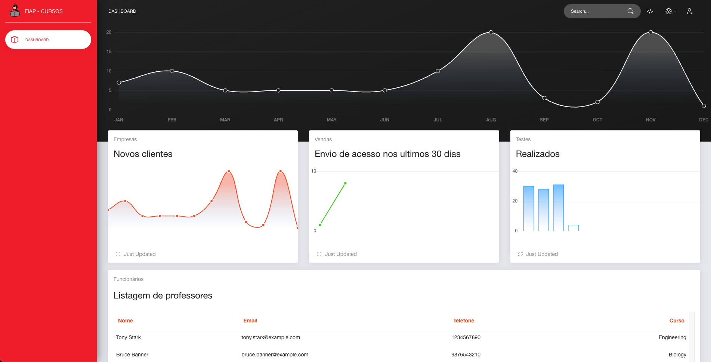

# Curso de persistencia de dados

Este repositório tem dois projetos, um angular para representar um dashboard do nosso desafio proposto e um outro com um projeto Java utilizando o Spring boot. 

## Estrutura

### Angular
O projeto angular esta desenvolvido com apenas um componente de dashboard com 4 dashs e uma lista de professores.

### Spring boot

O projeto backend esta com uma estrutura básica de camadas como:
* Controller
* Service
* Repository
* Model

## Executar os projetos

### Angular
Para rodar o projeto angular basta executar o comando `ng serve --open` esse comando vai abrir o seu projeto na portal 4200 do seu navegador.

### Spring boot
Para rodar o projeto você deve executar no seu terminal o comando `mvn spring-boot:run` ele vai subir o seu projeto na porta 8080.

